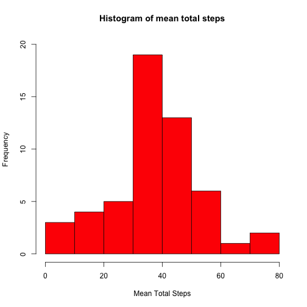
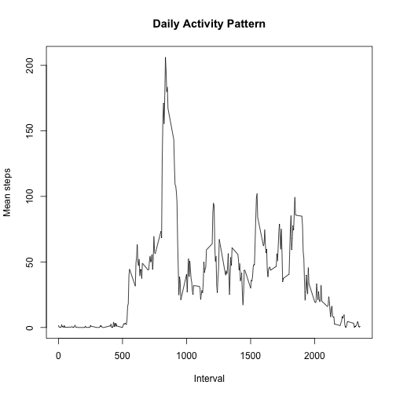
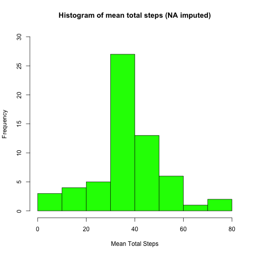
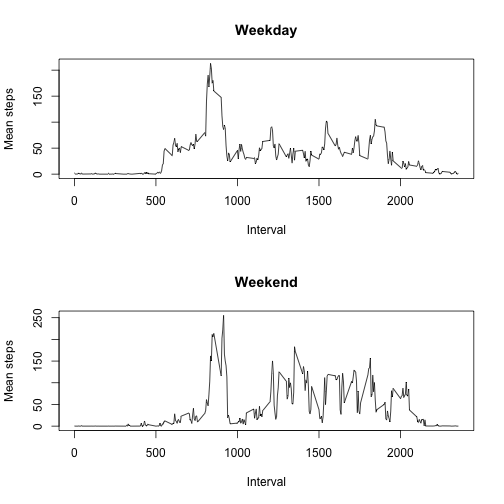

## Loading and preprocessing the data


```r
# I decided to use the base plotting system and try to do the analysis with R core functions so that
# no additional packages need to be installed

df <- read.csv('activity.csv')
```


## What is mean total number of steps taken per day?


```r
mean_total_steps <- data.frame(tapply(df$steps, df$date, mean))
names(mean_total_steps) <- c('mean_steps')
mean_total_steps$date <- as.Date(rownames(mean_total_steps))
hist(mean_total_steps$mean_steps, main='Histogram of mean total steps', xlab="Mean Total Steps",col="red", ylim=c(0,20))
```

 

```r
d1 <- data.frame(tapply(df$steps, df$date, mean))
d2 <- data.frame(tapply(df$steps, df$date, median))
tab <- cbind(d1,d2)
names(tab) <- c('Mean', 'Median')
tab
```

```
##                  Mean Median
## 2012-10-01         NA     NA
## 2012-10-02  0.4375000      0
## 2012-10-03 39.4166667      0
## 2012-10-04 42.0694444      0
## 2012-10-05 46.1597222      0
## 2012-10-06 53.5416667      0
## 2012-10-07 38.2465278      0
## 2012-10-08         NA     NA
## 2012-10-09 44.4826389      0
## 2012-10-10 34.3750000      0
## 2012-10-11 35.7777778      0
## 2012-10-12 60.3541667      0
## 2012-10-13 43.1458333      0
## 2012-10-14 52.4236111      0
## 2012-10-15 35.2048611      0
## 2012-10-16 52.3750000      0
## 2012-10-17 46.7083333      0
## 2012-10-18 34.9166667      0
## 2012-10-19 41.0729167      0
## 2012-10-20 36.0937500      0
## 2012-10-21 30.6284722      0
## 2012-10-22 46.7361111      0
## 2012-10-23 30.9652778      0
## 2012-10-24 29.0104167      0
## 2012-10-25  8.6527778      0
## 2012-10-26 23.5347222      0
## 2012-10-27 35.1354167      0
## 2012-10-28 39.7847222      0
## 2012-10-29 17.4236111      0
## 2012-10-30 34.0937500      0
## 2012-10-31 53.5208333      0
## 2012-11-01         NA     NA
## 2012-11-02 36.8055556      0
## 2012-11-03 36.7048611      0
## 2012-11-04         NA     NA
## 2012-11-05 36.2465278      0
## 2012-11-06 28.9375000      0
## 2012-11-07 44.7326389      0
## 2012-11-08 11.1770833      0
## 2012-11-09         NA     NA
## 2012-11-10         NA     NA
## 2012-11-11 43.7777778      0
## 2012-11-12 37.3784722      0
## 2012-11-13 25.4722222      0
## 2012-11-14         NA     NA
## 2012-11-15  0.1423611      0
## 2012-11-16 18.8923611      0
## 2012-11-17 49.7881944      0
## 2012-11-18 52.4652778      0
## 2012-11-19 30.6979167      0
## 2012-11-20 15.5277778      0
## 2012-11-21 44.3993056      0
## 2012-11-22 70.9270833      0
## 2012-11-23 73.5902778      0
## 2012-11-24 50.2708333      0
## 2012-11-25 41.0902778      0
## 2012-11-26 38.7569444      0
## 2012-11-27 47.3819444      0
## 2012-11-28 35.3576389      0
## 2012-11-29 24.4687500      0
## 2012-11-30         NA     NA
```

## What is the average daily activity pattern?


```r
# Remove NA's for line plot
df2 <- subset(df, !is.na(df$steps))

daily_act <- data.frame(tapply(df2$steps, df2$interval, mean))
names(daily_act) <- c('mean_steps')
daily_act$interval <- rownames(daily_act)
plot(daily_act$interval, daily_act$mean_steps, type='l',xlab='Interval',ylab='Mean steps', main='Daily Activity Pattern')
```

 

## Imputing missing values


```r
# Number of rows with NA
sum(is.na(df$step))
```

```
## [1] 2304
```

```r
# Create new dataframe with imputed NA's based on resp. interval mean
df_comp <- df

for(i in 1:nrow(df_comp)){
    if(is.na(df_comp$steps[i])){  
        df_comp$steps[i] <- daily_act$mean_steps[which(daily_act$interval == df_comp$interval[i])][1]
    }
}

# Histogram
mean_total_steps2 <- data.frame(tapply(df_comp$steps, df_comp$date, mean))
names(mean_total_steps2) <- c('mean_steps')
mean_total_steps2$date <- as.Date(rownames(mean_total_steps2))
hist(mean_total_steps2$mean_steps, main='Histogram of mean total steps (NA imputed)', xlab="Mean Total Steps",col="green", ylim=c(0,30))
```

 

```r
# Table with Means and Medians
d3 <- data.frame(tapply(df_comp$steps, df_comp$date, mean))
d4 <- data.frame(tapply(df_comp$steps, df_comp$date, median))
tab2 <- cbind(d3,d4)
names(tab2) <- c('Mean', 'Median')
tab2
```

```
##                  Mean   Median
## 2012-10-01 37.3825996 34.11321
## 2012-10-02  0.4375000  0.00000
## 2012-10-03 39.4166667  0.00000
## 2012-10-04 42.0694444  0.00000
## 2012-10-05 46.1597222  0.00000
## 2012-10-06 53.5416667  0.00000
## 2012-10-07 38.2465278  0.00000
## 2012-10-08 37.3825996 34.11321
## 2012-10-09 44.4826389  0.00000
## 2012-10-10 34.3750000  0.00000
## 2012-10-11 35.7777778  0.00000
## 2012-10-12 60.3541667  0.00000
## 2012-10-13 43.1458333  0.00000
## 2012-10-14 52.4236111  0.00000
## 2012-10-15 35.2048611  0.00000
## 2012-10-16 52.3750000  0.00000
## 2012-10-17 46.7083333  0.00000
## 2012-10-18 34.9166667  0.00000
## 2012-10-19 41.0729167  0.00000
## 2012-10-20 36.0937500  0.00000
## 2012-10-21 30.6284722  0.00000
## 2012-10-22 46.7361111  0.00000
## 2012-10-23 30.9652778  0.00000
## 2012-10-24 29.0104167  0.00000
## 2012-10-25  8.6527778  0.00000
## 2012-10-26 23.5347222  0.00000
## 2012-10-27 35.1354167  0.00000
## 2012-10-28 39.7847222  0.00000
## 2012-10-29 17.4236111  0.00000
## 2012-10-30 34.0937500  0.00000
## 2012-10-31 53.5208333  0.00000
## 2012-11-01 37.3825996 34.11321
## 2012-11-02 36.8055556  0.00000
## 2012-11-03 36.7048611  0.00000
## 2012-11-04 37.3825996 34.11321
## 2012-11-05 36.2465278  0.00000
## 2012-11-06 28.9375000  0.00000
## 2012-11-07 44.7326389  0.00000
## 2012-11-08 11.1770833  0.00000
## 2012-11-09 37.3825996 34.11321
## 2012-11-10 37.3825996 34.11321
## 2012-11-11 43.7777778  0.00000
## 2012-11-12 37.3784722  0.00000
## 2012-11-13 25.4722222  0.00000
## 2012-11-14 37.3825996 34.11321
## 2012-11-15  0.1423611  0.00000
## 2012-11-16 18.8923611  0.00000
## 2012-11-17 49.7881944  0.00000
## 2012-11-18 52.4652778  0.00000
## 2012-11-19 30.6979167  0.00000
## 2012-11-20 15.5277778  0.00000
## 2012-11-21 44.3993056  0.00000
## 2012-11-22 70.9270833  0.00000
## 2012-11-23 73.5902778  0.00000
## 2012-11-24 50.2708333  0.00000
## 2012-11-25 41.0902778  0.00000
## 2012-11-26 38.7569444  0.00000
## 2012-11-27 47.3819444  0.00000
## 2012-11-28 35.3576389  0.00000
## 2012-11-29 24.4687500  0.00000
## 2012-11-30 37.3825996 34.11321
```

Do these values differ from the estimates from the first part of the assignment? 
*Yes, these valued differ. 

What is the impact of imputing missing data on the estimates of the total daily number of steps?
* They are higher for the imputed data set. The reason for this is that there are no 'negative' steps so imputing NAs will just increase the total number of steps.


## Are there differences in activity patterns between weekdays and weekends?


```r
# Create new factor variable
df_comp$date <- as.Date(df_comp$date)
df_comp$is_weekday <- as.factor(ifelse(weekdays(df_comp$date) =="Saturday" | weekdays(df_comp$date) =="Saturday",'no','yes'))

# subset along new variable
weekday <- subset(df_comp, df_comp$is_weekday == 'yes')
weekend <- subset(df_comp, df_comp$is_weekday == 'no')
# Calculate means
da_wd <- data.frame(tapply(weekday$steps, weekday$interval, mean))
names(da_wd) <- c('mean_steps')
da_wd$interval <- rownames(da_wd)
da_we <- data.frame(tapply(weekend$steps, weekend$interval, mean))
names(da_we) <- c('mean_steps')
da_we$interval <- rownames(da_we)

# Setup panel plot 
par(mfrow = c(2, 1))
plot(da_wd$interval, da_wd$mean_steps, type='l',xlab='Interval',ylab='Mean steps', main='Weekday')
plot(da_we$interval, da_we$mean_steps, type='l',xlab='Interval',ylab='Mean steps', main='Weekend')
```

 
